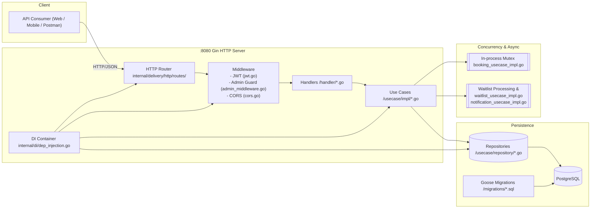
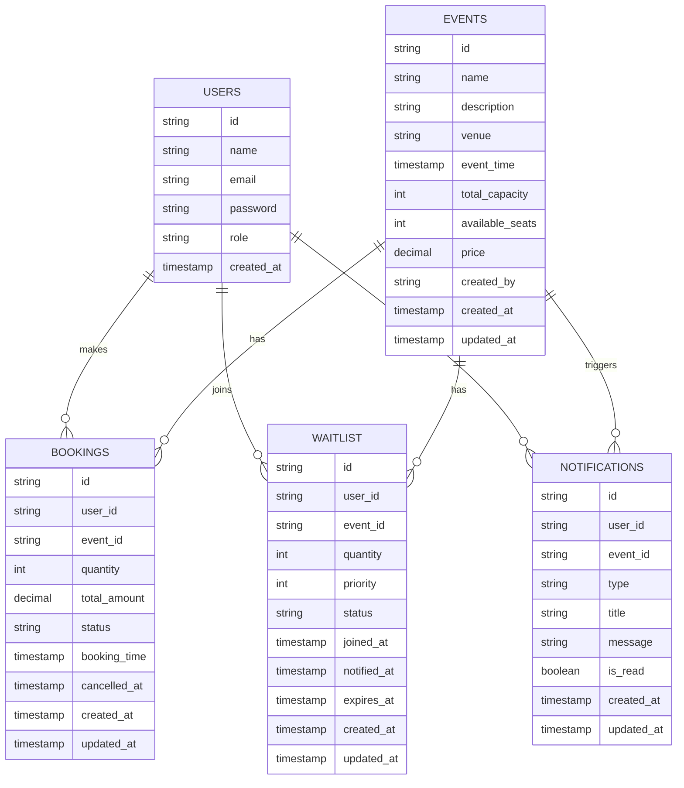

# Evently Atlan Backend Engineering Intern Challenge

Postman Collection: [Postman Collection](https://www.postman.com/arman22102-3102413/workspace/atlan-assignment/collection/47632237-08cfe0cc-94bb-4717-add4-9a3d6caf8050?action=share&creator=47632237)

Evently is a backend service for creating and managing events, enabling users to book tickets, handling full-capacity scenarios via a waitlist, and providing admin analytics on bookings and event performance.

- Language: Go
- Framework: Gin
- Database: PostgreSQL (pgx/pgxpool)
- Migrations: goose
- Auth: JWT
- Architecture: Clean Architecture with DI and layered domains


---

## High-Level Architecture Diagram



## Entity-Relationship (ER) Diagram



## Short Documentation

### Design Decisions and Trade-offs

#### Clean Architecture separation
- Handlers (`internal/delivery/http/handler/*.go`) only parse/validate input and call use cases.
- Use cases (`internal/usecase/impl/*.go`) contain business logic:
  - Events: validation and orchestration (`event_usecase_impl.go`).
  - Bookings: concurrency guard, seat accounting, cancellation, analytics (`booking_usecase_impl.go`).
  - Waitlist: queue membership, position, notification and expiration (`waitlist_usecase_impl.go`).
  - Auth: bcrypt hashing and JWT issuance (`auth_usecase_impl.go`).
- Repositories (`internal/usecase/repository/*.go`) handle Postgres I/O with pgxpool.
- DI container (`internal/di/dep_injection.go`) wires config, DB pool, repositories, use cases, middleware, and Gin server.

### Concurrency handling for bookings
- In-process mutex in booking use case to serialize critical section for seat availability checks and updates.
- DB conditional update guarantees non-negative `available_seats`:

```sql
UPDATE events
SET available_seats = available_seats + $2
WHERE id = $1 AND available_seats + $2 >= 0;
```

- Trade-off: Great for single-instance. For multi-instance scalability, use DB transactions with row locks or distributed locking (e.g., Postgres advisory locks).

### Database schema
- Constraints and indices for correctness and performance:
  - `users.email` unique.
  - `waitlist` unique (`user_id`, `event_id`).
  - Enum-like checks on `bookings.status` and `waitlist.status`.
  - Useful indices on event time, status, user, event foreign keys.

### Scalability and Fault Tolerance
- Stateless HTTP with JWT enables horizontal scaling.
- Postgres as the source of truth; scale vertically and with read replicas for read-heavy analytics/listing.
- For multi-instance booking safety:
  - Use transactions and `SELECT ... FOR UPDATE` on the event row, or Postgres advisory locks.
- Graceful shutdown with context and server timeouts (`cmd/app.go`).
- Automatic migrations on startup and DB ping checks (`internal/config/config.go`).

### Notable Features / Optimizations
- Automatic waitlist fallback on seat exhaustion with position reporting.
- Admin analytics:
  - “Most popular events” with utilization calculated in a single SQL (`event_repository_impl.go`).
  - Per-event booking stats (confirmed/cancelled/pending, revenue) (`booking_repository_impl.go`).
- Persisted notifications ready for integration with email/SMS/push.

## API Documentation (Concise)

- Base URL: `http://localhost:8080/api`

### Auth
- POST `/auth/register` — Create user (bcrypt)
- POST `/auth/login` — Returns JWT token

### Events
- GET `/events?limit&offset` — Public list of upcoming events
- GET `/events/:id` — Public event details
- POST `/events` — Admin only
- PUT `/events/:id` — Admin only
- DELETE `/events/:id` — Admin only

### Bookings
- POST `/bookings` — Create booking (JWT). Auto-joins waitlist if full.
- GET `/bookings/:id` — Owner or admin
- PUT `/bookings/:id/cancel` — Owner
- GET `/bookings/my?limit&offset` — My bookings and waitlist entries

### Admin
- GET `/admin/events?limit&offset`
- GET `/admin/events/:eventId/bookings?limit&offset`
- GET `/admin/events/:eventId/analytics`
- GET `/admin/analytics/events?limit`

- Auth header for protected routes: `Authorization: Bearer <JWT>`

## Notes
- Diagrams use Mermaid and render on GitHub and many modern IDEs. If they don’t render, use a Mermaid-compatible viewer or extension.
- Key Go packages and paths mentioned in the diagrams:
  - `internal/delivery/http/handlers/`
  - `internal/delivery/http/middleware/`
  - `internal/usecase/impl/`
  - `internal/usecase/repository/`
  - `internal/di/dep_injection.go`
  - `migrations/` (Goose SQL migrations)
- Default server port: `:8080`.
